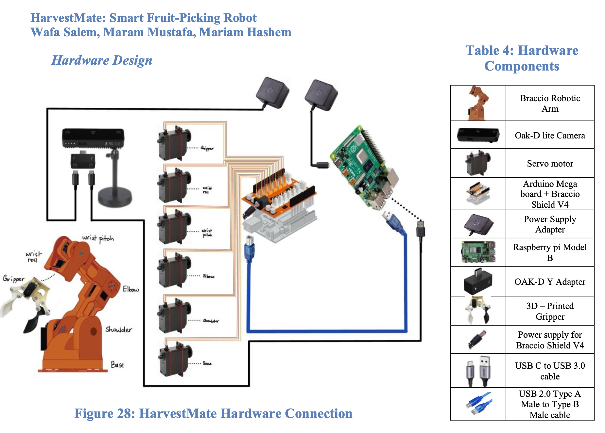
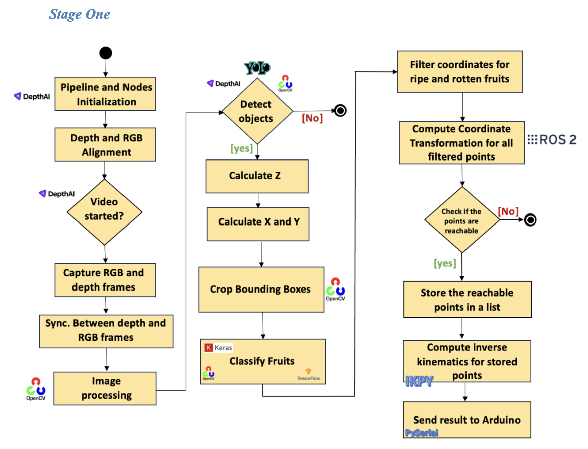
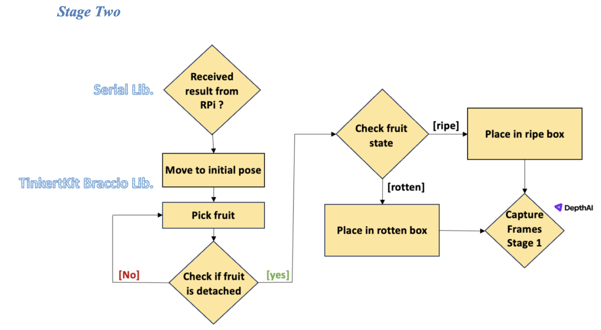
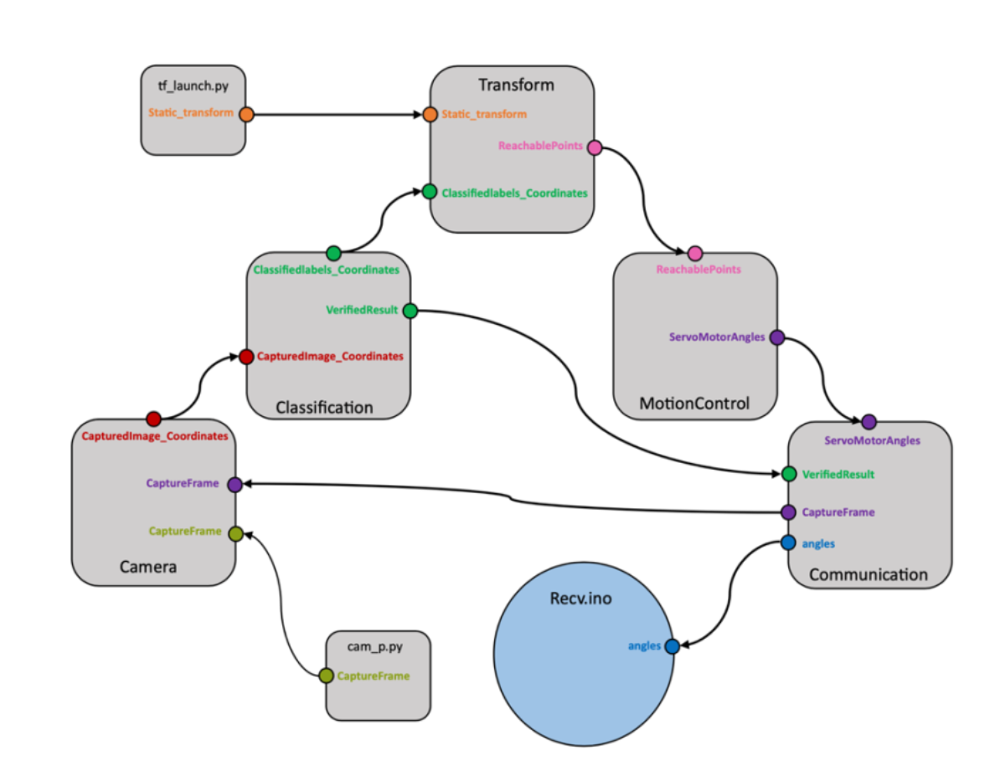

# HarvestMate

Robotics and Artificial intelligence are becoming substantial tools in shaping the future of agriculture and addressing its challenges. Empowering small-scale agriculture, this project tackles the inefficiency and wastage in fruit harvesting for small-scale growers. They lack expertise, time, and rely on manual methods, resulting in suboptimal harvests, significant agricultural waste, and huge profit loss. Existing solutions designed for large farms are costly and inaccessible to smaller growers. HarvestMate bridges the gap between manual methods and large-scale solutions by providing accessible technology that is user-friendly and costeffective. The project integrates a robotic arm with machine learning models that detect and classify fruit ripeness using colored images. A camera captures fruit data, and the deep learning models determine the fruit type and its ripeness. The robotic arm picks and sorts fruits into designated areas for ripe and rotten fruits. The project’s performance measures include increased fruit yield, reduced post-harvest losses, and improved profitability for small-scale growers, contributing to a more sustainable and efficient agricultural sector. 

# Hardware Design 

The images below presents the hardware setup of the project : 

# Software flowcharts 

At the start, the pipeline and nodes are initialized and the RGB and depth frames of the camera are aligned. After that, when the camera is activated, it will start capturing frames, which will be processed for initial enhancement using the OpenCV library. These refined frames will then be passed to the YOLO V7 object detection algorithm, which will identify whether the objects in the frames are apples or oranges. The identified objects will be sent to the DepthAI library to compute the X, Y, Z coordinates. Following this, images of the fruits with calculated coordinates will be sent to the classification model that utilizes TensorFlow and Keras libraries to classify them as ripe, rotten, or unripe and save them in a list. The list is then filtered to keep the coordinates of ripe and rotten fruits only. Subsequently, coordinate transformation will be applied using ROS 2 to find all coordinates relative to the base of the robotic arm. Each coordinate will then be passed to a function to check if it is reachable or not. Once reachability of all points has been determined, inverse kinematics will be computed for all coordinates using the IKPY library, and the resulting data will be transmitted to the Arduino microcontroller via serial communication using the pySerial library for further processing and utilization.  

The Arduino microcontroller will remain in a waiting state until it receives the result from the Raspberry Pi via the Serial library. Upon receiving the data, the robotic arm will move to the initial pose and proceed to pick the fruit using the Tinkerkit Braccio and servo libraries. The detachment process will be verified by detecting and classifying the fruit held by the end effector using the OAK-D Lite camera and Raspberry Pi. If the fruit wasn't detached, the picking process will be repeated once. Otherwise, upon successful detachment, if the fruit is identified as ripe, the robotic arm will place it in the ripe box. Conversely, if the fruit is found to be rotten, the robotic arm will place it in the designated rotten box. Following this, the system will repeat the process of capturing frames from stage one. 

# Software components flow 

After conducting individual tests on each component, we utilized ROS2 as well as RabbitMQ to integrate all the different parts. As illustrated in the figure 75, we developed five packages to facilitate communication: Camera, Classification, Transform, Motion Control, and Communication. Each package is designed to execute a specific task and publish the results to another package for further processing. 
The cam_p.py script initiates the process by publishing to the CaptureFrame topic. 
The Camera Package subscribes to the CaptureFrame topic. Upon receiving data, it captures a frame and passes it to the object detection model to identify fruits. Subsequently, it calculates the x, y, z coordinates of the detected fruits and publishes a list of labels, xyz coordinates, and bounding boxes to the CaptureImage_Coordinates topic. 
The Classification Package subscribes to the CaptureImage_Coordinates topic. Upon receiving data, it crops the detected fruits using the provided bounding boxes and classifies each fruit as ripe, unripe, or rotten using a classification model. It filters the results to retain only the ripe and rotten fruits, then publishes the classified labels with their xyz coordinates to the ClassifiedLabels_Coordinates topic. 
The Transform Package continuously listens for static transform frames broadcasted by tf_launch.py, which provides the locations of the camera and robotic arm frames relative to the world. It also subscribes to the ClassifiedLabels_Coordinates topic, and upon receiving data, it applies coordinate transformation to convert points from the camera frame to the robotic arm frame. It then assesses each point for reachability by the robotic arm. Reachable points are added to a new list and published to the ReachablePoints topic along with the labels. 
The Motion Control Package subscribes to the ReachablePoints topic. When it receives data, it computes the inverse kinematics for all points to determine the servo motor angles for each point, then publishes the labels and servo motor angles to the ServoMotorAngles topic. 
The Communication Package subscribes to the ServoMotorAngles topic. Upon receipt, it sends the first set of servo motor angles to the Arduino. After a pause—allowing time for the robotic arm to pick the fruit—it publishes to the CaptureFrame topic, prompting the camera to capture another frame for detection and classification. If a fruit is detected, the Classification 
Package compares the new classification with the previous one to correct any misclassifications, then publishes the updated label to the VerifiedResult topic. If no fruit is detected, it publishes "no" to the VerifiedResult topic. The Communication Package, upon receiving data from the VerifiedResult topic, sends the appropriate servo motor angles to the Arduino: angles for the ripe box if a ripe fruit is detected, angles for the rotten box if a rotten fruit is detected, or repeats the same angles if "no" is received, to attempt picking the fruit again. If "no" is received again, the process moves to the next point. 

